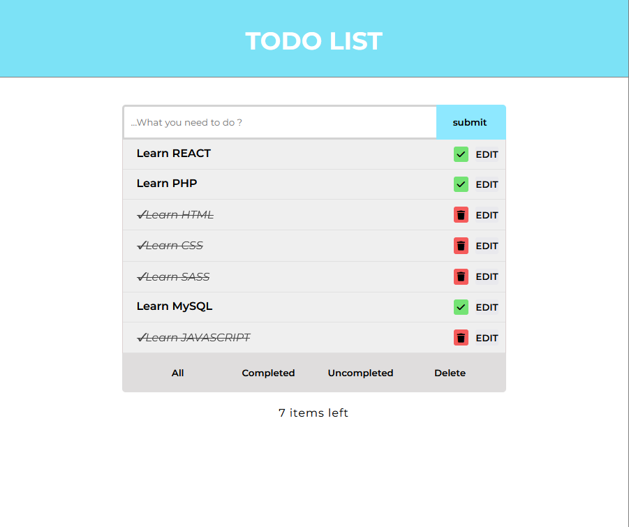

# todo-react

## Intro to React @Becode

Link -> https://peaceful-dolphin-566252.netlify.app/

This is an introduction to react technology. I had to make a functional todo list with the help of tutorials and documentation.

### Functionalities

-   Save todo in local storage
-   add
-   delete
-   edit
-   sort by complete/uncomplete/all

    

## Technologies

-   REACT
-   SASS

## What else should i do ?

Implement Drag & Drop and improve the style a little bit

by Quentin https://github.com/QuentinMotte
